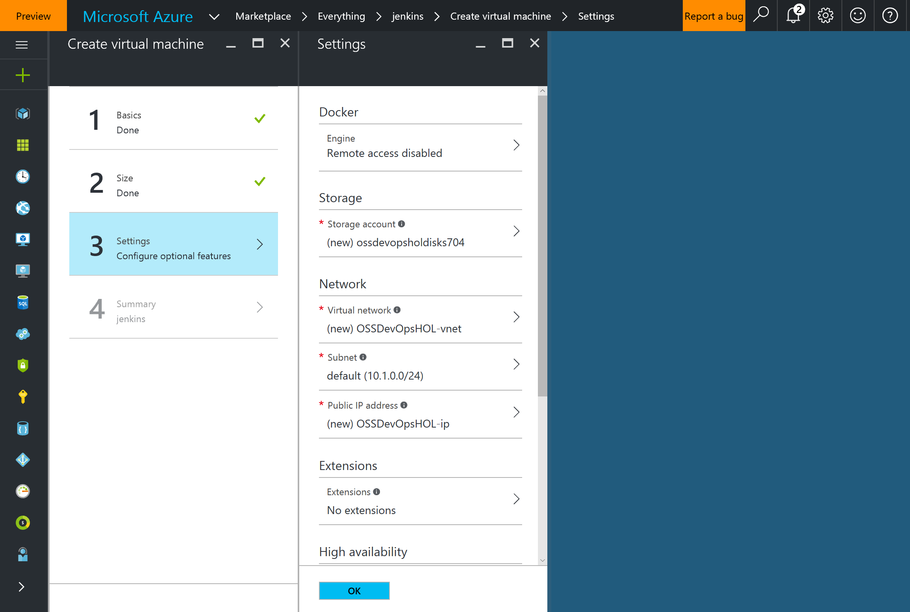
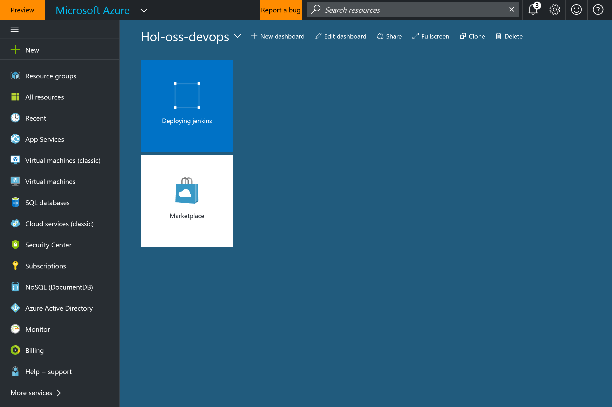
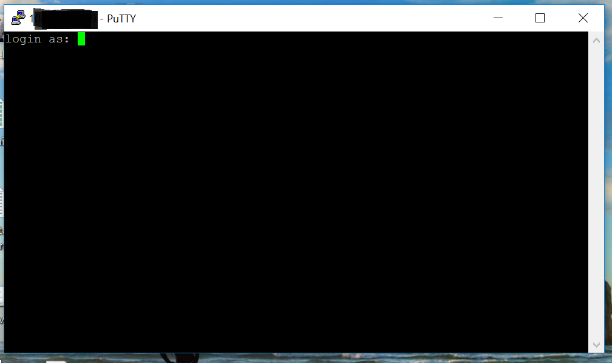
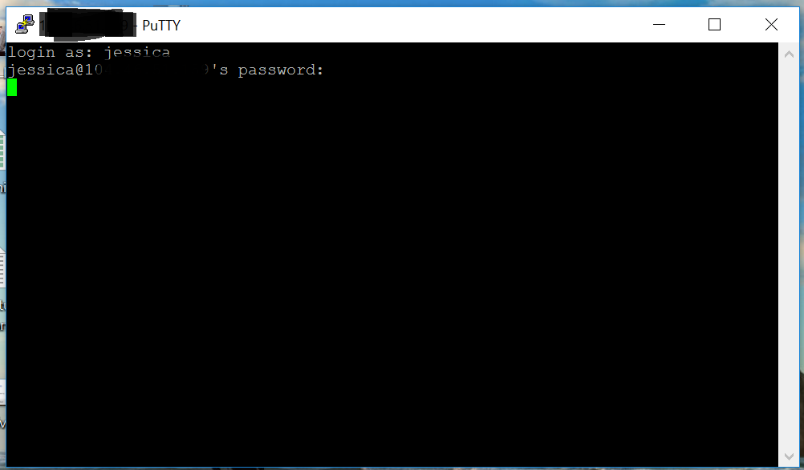
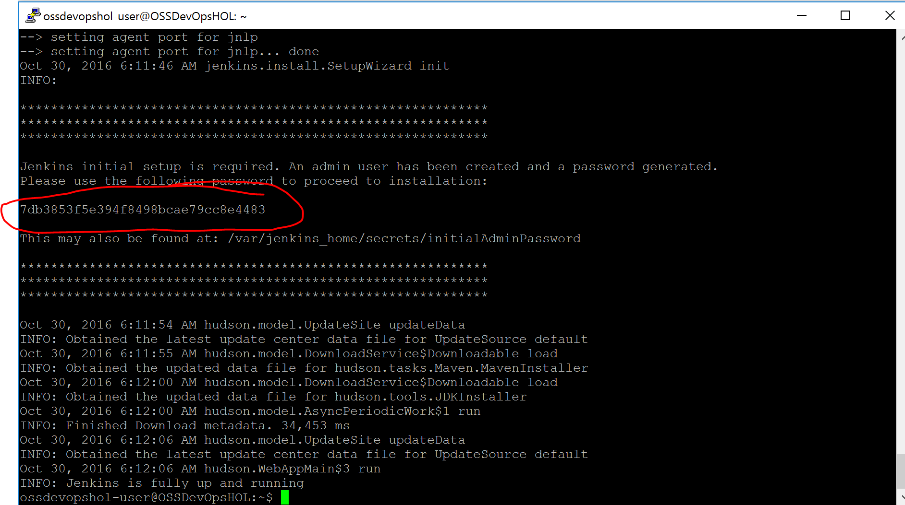
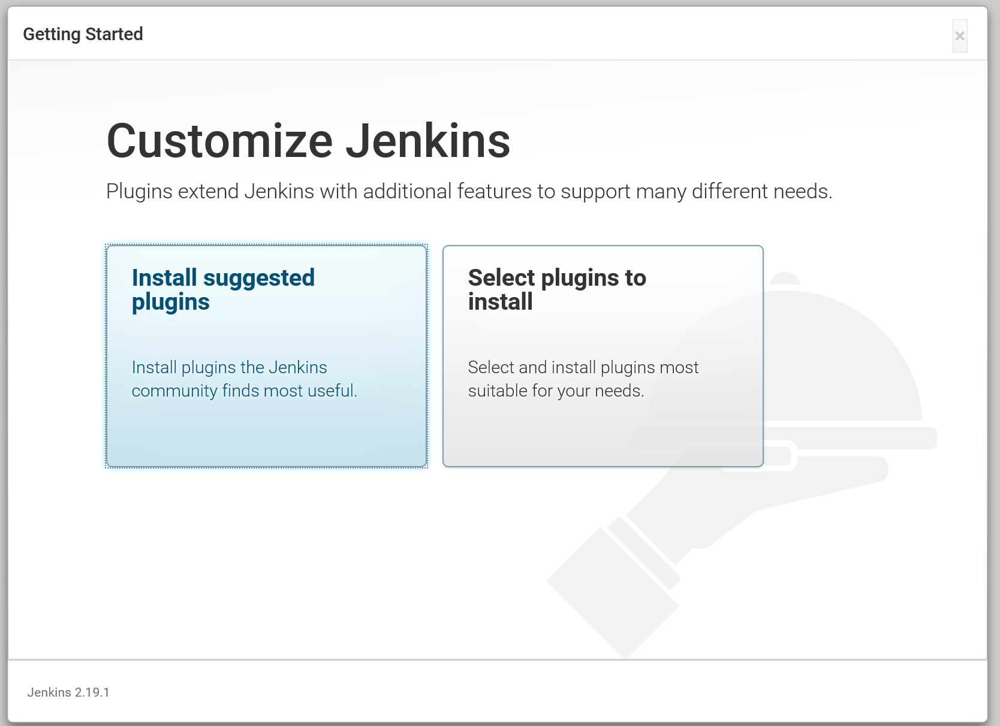
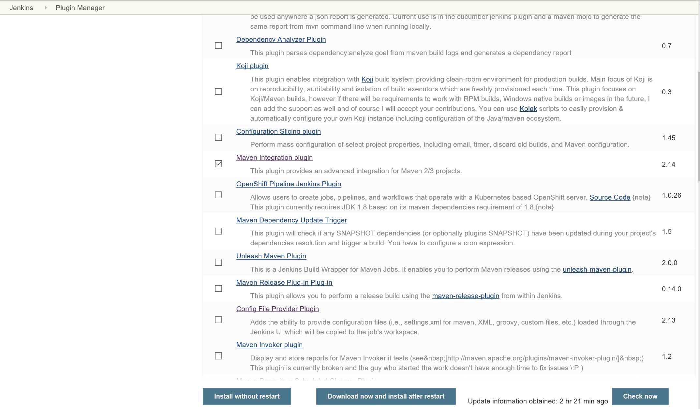
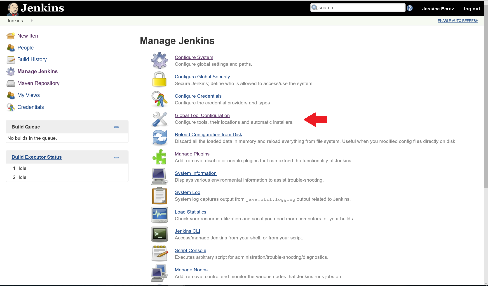
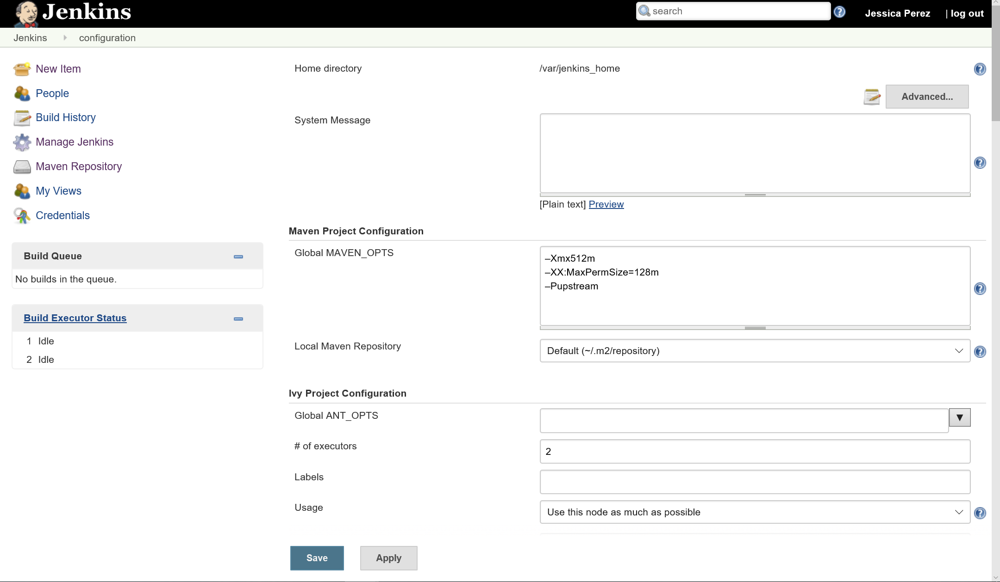

# 2. Setting up Jenkins Job

## 2.1 Overview
In this lab, we will use Jenkins to create a build using maven to use it in our HOL-OSS-DEVOPS project.

### 2.1.1 Objectives
This lab aims to get you familiar with Jenkins on Azure Cloud.

### 2.1.2 Requerimients
You must have the Azure account mentioned in Lab 01.

## 2.2 Creating a VM in Azure running Jenkins

1. Browse to Azure Portal

   You can use all the Jenkins templates showed below; for this lab we will use Jenkis template published by Docker. This will setp up an Ubuntu VM with the Docker engine installed and a Jenkins container running on it. 
   

2. Click Create to begin the creation of the VM. 


3. Fill in the basic machine settings:

    **Name:** OSSDevOpsHOL  
    **VM Disk Type:** HDD  
    **Username:** ossdevopshol-user  
    **Authentication type:** Password  
    **Password:** Choose a password you will remember  
    **Subscription:** Your Azure subscription  
    **Resource group:** (Create new) OSSDevOpsHOL  
    **Location:** Your preferred location


4. Select the "A0 Basic" virtual machine size. If you are unable to see this machine size, make sure you are viewing "All" machine sizes and not only those that are "Recommended" (you can toggle this view in the upper right corner of the machine size viewer).
 

5. In the third step you can select optional extensions to be installed, but we will simply leave this as-is and select OK to move to the next step.
   

6. Validate the configuration settings you've selected and click OK. 


7. The machine will now be deployed for you: 


## 2.3 Unlock Jenkins

1. When the VM has been deployed, select the machine to open the overview window as shown below.


2. Take note of the "Public IP address" of your machine, you will need this in the next step to access jenkins

3. Go to http://{your-public-ip}:8080 to access Jenkins

4. When you log in to Jenkins for the first time, it will ask you to unlock it. To unlock, we will connect directly to the machine that Jenkins in installed on and retrieve the password.
   

5. If you don't have PuTTY already, [download the PuTTY client here](http://www.putty.org/).

6. Run the PuTTY.exe file to start the client. 

7. Enter the public IP address from step 2 into the "Host name (or IP address) textbox" and click "Open" to connect to the machine. 
   

8. When you receive a PuTTY Security Alert, click "Yes"
   
   
9. When asked, type in the username and password you specified when you created the virtual machine in section 2.2 of this lab. 
   

   

   

10. In order to access the Administrators password used to unlock Jenkins, we need to access the Docker container in which Jenkins is installed. List all containers by running the following command:

    ```
    docker ps
    ``` 

11. Now that we have the container ID of the Jenkins container, we can access its logs by running the following command: 

    ```
    docker logs {containerID}
    ``` 

12. You will now see the Administrators password required to unlock Jenkins: 
      

13. Provide the Administratior password and continue to the next step.
  

14. Select "Install suggested plugins" and wait for the installation to complete.
      
      

15. Create a new admin user in Jenkins by filling out the following fields and clicking "Save and Finish"
   

16. Once you have created a new user, Jenkins is ready! Click "Start using Jenkins" to proceed.
   

## 2.3 Configuring a Maven build in Jenkins

1. Install maven plugins
   
      To create our build we will need install the maven plugins. Browse to Manage Jenkins-> Manage Plugins
   

     

2. Create a new Item and select an FreeStyle Project


      

3. Provide all the information and clicking on "Save"


4. Maven Configuration

      Go to the main page and select Manage Jenkins as is showing below.


    Select Global Tool Configuration and create a Maven installation.

    

    

    

    After maven installation you should configure the Maven Option Variables.
    Browse to Configure System and Select Maven Project Configuration.

     

    
