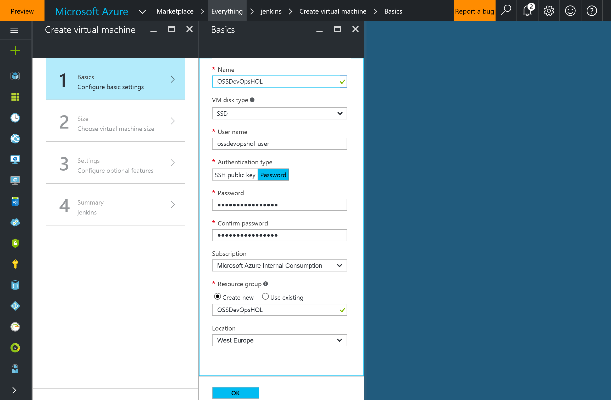
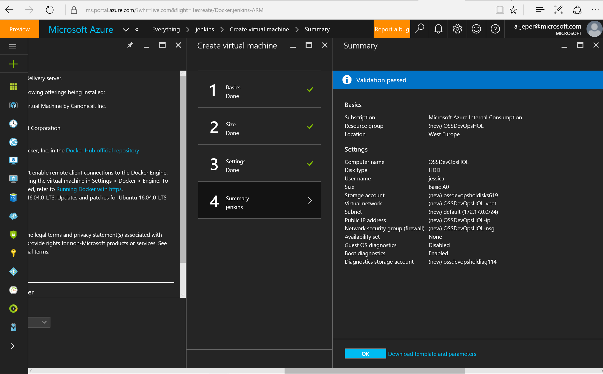
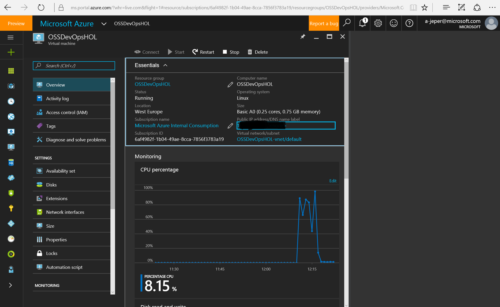
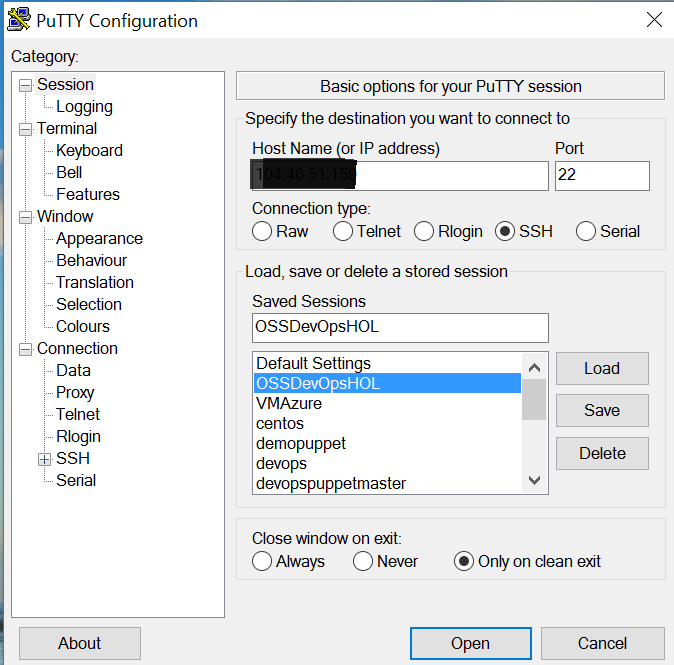
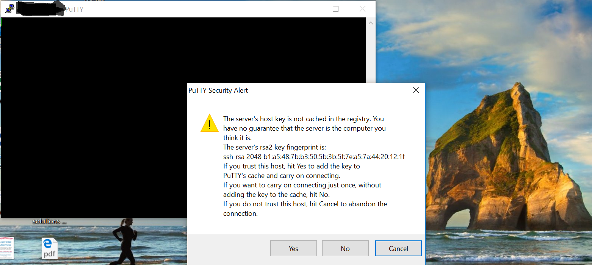
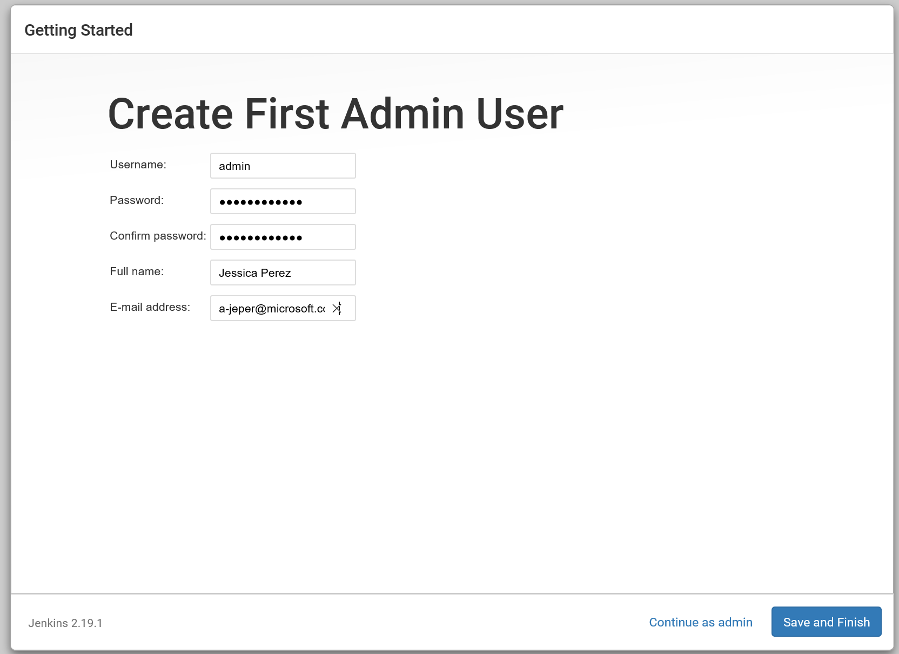
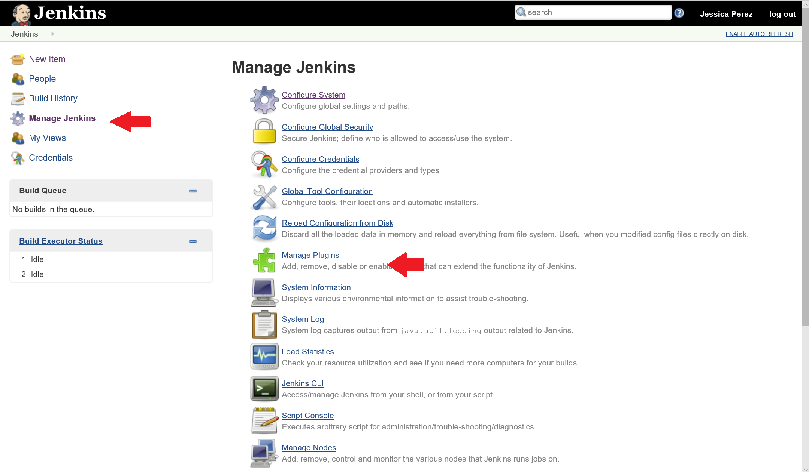
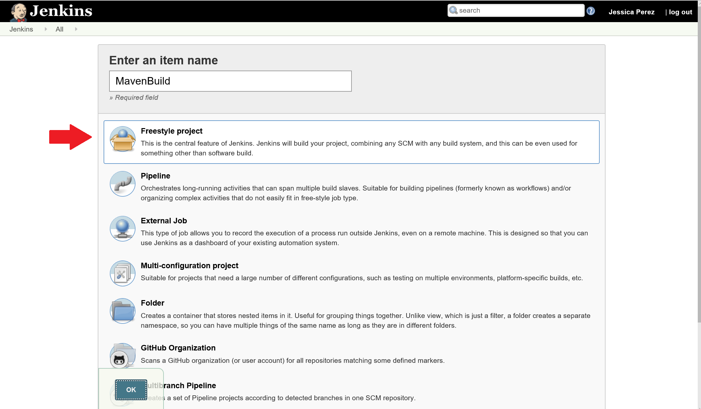
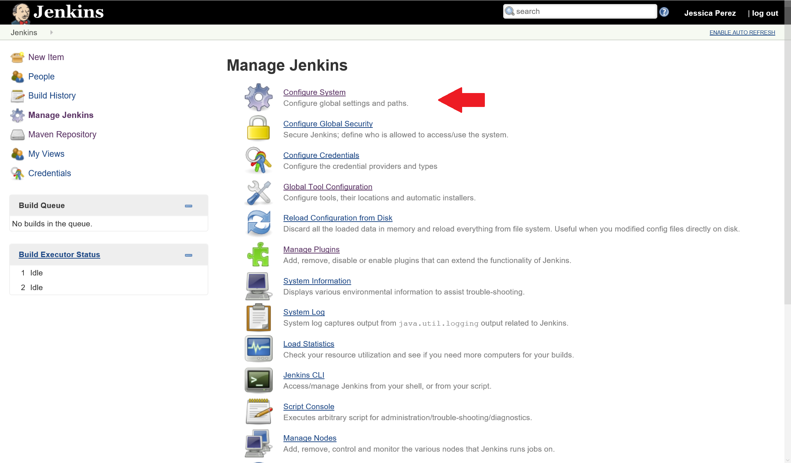

# 2. Setting up Jenkins Job

## 2.1 Overview
In this lab, we will use Jenkins to create a build using maven to use it in our HOL-OSS-DEVOPS project.

### 2.1.1 Objectives
This lab aims to get you familiar with Jenkins on Azure Cloud.

### 2.1.2 Requerimients
You must have the Azure account mentioned in Lab 01.

## 2.2 Setting up the Jenkins Machine
### 2.2.1 Using Azure

1. Browse to Azure Portal

   You can use all the Jenkins templates showed below; for this lab we will use Jenkis template published by Docker.
   

2. Create a Jenkins Machine

3. Fill all the fields

4. Select the machine size
 

   

5. Validate the configuration selected

6. Deploy the machine

7. Login in your Jenkins server with the defult credentials.
   
   After the machine is deployed. When you login for the first time to jenkins it will ask for unlock
   

   To unlock Jenkins you should connect directly to the machine created in step 6 and look in the "initialAdminPassword" file. We will use Putty to look in this file as is showing below.
   
   Connecting to the machine
   

   
   
   Providing user and password. **You defined this values in step 3**
   

   

   

   Once we find the file. **Please notice the path.**
  

   Now we can provide the Administratior password and continue to the next step.
  

8. Create a new Jenkins user

   After unlock Jenkins you will see the next webpage

   

   Once that you create a new user Jenkins is ready to use it
   

9. Customize Jenkins clicking on "Install suggested plugins"

   Right after create a new user you must to install the Jenkins plugins

10. Install maven plugins
   
      To create our build we will need install the maven plugins. Browse to Manage Jenkins-> Manage Plugins
   

     

11. Create a new Item and select an FreeStyle Project

      

12. Provide all the information and clicking on "Save"

13. Maven Configuration

      Go to the main page and select Manage Jenkins as is showing below.

    Select Global Tool Configuration and create a Maven installation.

    

    

    

    After maven installation you should configure the Maven Option Variables.
    Browse to Configure System and Select Maven Project Configuration.

     

    

